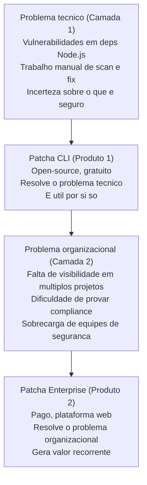
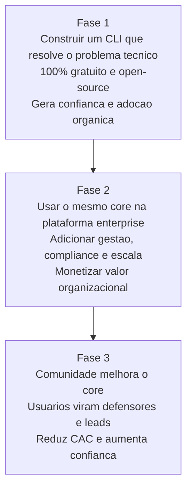
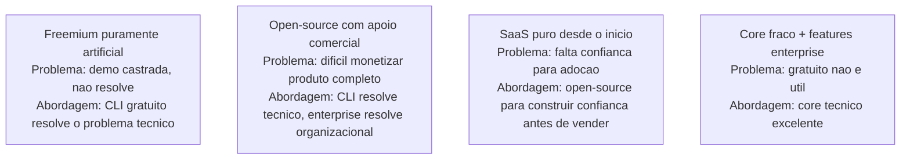
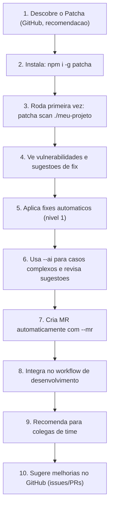
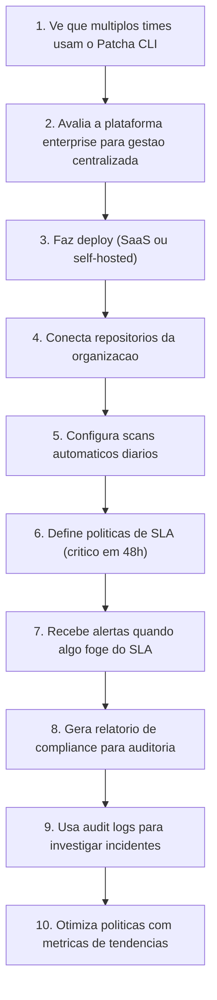
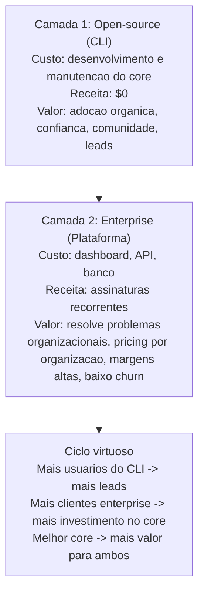
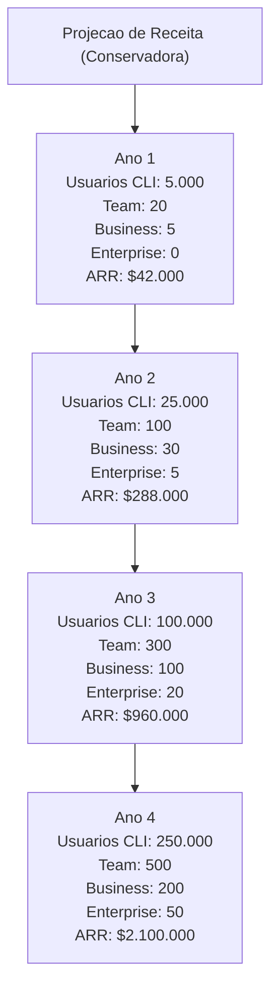
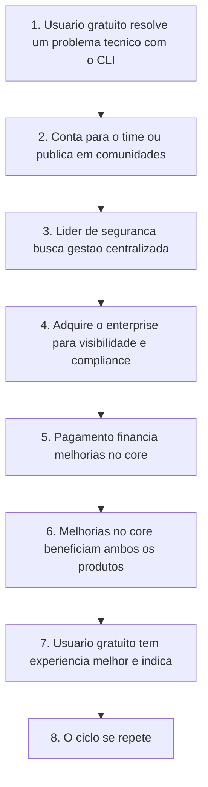

# Visão Geral — Patcha

> Da solução técnica para o problema organizacional: como um CLI open-source evolui para uma plataforma de segurança de dependências enterprise.

---

## Índice

1. [A Visão Única](#a-visão-única)
2. [O Problema em Duas Camadas](#o-problema-em-duas-camadas)
3. [A Estratégia de Produto](#a-estratégia-de-produto)
4. [A Jornada do Usuário](#a-jornada-do-usuário)
5. [O Modelo de Negócio](#o-modelo-de-negócio)
6. [O Ciclo de Valor](#o-ciclo-de-valor)
7. [Por Que Isso Funciona](#por-que-isso-funciona)
8. [Próximos Passos](#próximos-passos)

---

## A Visão Única

**Nossa visão é tornar a gestão de vulnerabilidades em dependências Node.js simples, automática e auditável — desde o desenvolvedor individual até a grande empresa.**

Não queremos ser apenas mais um scanner de vulnerabilidades. Queremos ser a plataforma que **elimina o trabalho manual** associado à segurança de dependências, transformando um processo reativo e doloroso em algo proativo e transparente.

Isse enxergamos isso em duas camadas inseparáveis:

---

## O Problema em Duas Camadas

### Camada 1: O Problema Técnico (Resolvido pelo CLI)

**O que o desenvolvedor sente:**
- "Tenho que rodar `npm audit` toda semana e ficar tentando entender o output"
- "O `npm audit fix` resolve algumas coisas, mas trava nos casos complexos"
- "Perco horas tentando descobrir se uma atualização vai quebrar algo"
- "Não tenho confiança de que estou realmente seguro"

**O que o CLI entrega:**
- Scan automático de `package.json` e `package-lock.json`
- Auto-fix para casos simples (patch/minor)
- Assistência de IA para casos complexos (major bumps, transitivas, libs abandonadas)
- Criação automática de MRs/PRs para revisão
- Tudo isso no terminal, onde o desenvolvedor já trabalha

**Resultado:** O desenvolvedor passa de 1h/semana em tarefas manuais para 10min revisando sugestões da IA.

### Camada 2: O Problema Organizacional (Resolvido pelo Enterprise)

**O que o líder de segurança / CTO sente:**
- "Não tenho visibilidade de quantos projetos têm vulnerabilidades críticas"
- "Não consigo provar pro auditor que estamos tratando CVEs em tempo hábil"
- "Minha equipe gasta horas gerando planilhas para reuniões de compliance"
- "Não sei se os desenvolvedores estão realmente aplicando os fixes"
- "Preciso de uma forma de escalar isso conforme crescemos"

**O que o Enterprise entrega:**
- Dashboard consolidado com visão de todos os projetos
- Relatórios de compliance prontos para auditor (SOC2, ISO 27001, PCI-DSS)
- Audit logs completos de quem aprovou o quê e quando
- SSO, roles e permissões para gestão de equipe
- Scans agendados e notificações automáticas
- API para integração com sistemas internos

**Resultado:** A equipe de segurança passa de 20h/semana em tarefas manuais para 2h revisando exceções e aprovando decisões estratégicas.

---

## A Estratégia de Produto: Open-Core Feito Certo

Nossa estratégia segue o modelo **open-core** que funcionou para empresas como GitLab, HashiCorp e Elastic, mas com uma diferença crucial: **o core técnico é tão bom que o open-source é valioso por si só**.

### Por Que Isso é Diferente de Outros Modelos

---

## A Jornada do Usuário

### Jornada do Desenvolvedor Individual (Produto 1)

**Resultado:** Desenvolvedor mais produtivo, menos ansioso sobre segurança, se sente empoderado.

### Jornada da Equipe de Segurança (Produto 2)

**Resultado:** Equipe de segurança mais estratégica, menos operacional, capaz de provar compliance facilmente.

---

## O Modelo de Negócio: Como Ganhamos Dinheiro

Nosso modelo é simples: **o open-source cria o mercado, o enterprise captura o valor**.

### Projeção de Receita (Conservadora)

**Assumptions:**
- Taxa de conversão: 0,5% dos usuários gratuitos para Team, 0,1% para Business, 0,02% para Enterprise
- Churn anual: 5%
- Preços conforme definido no plano enterprise

---

## O Ciclo de Valor: Como Ambos os Produtos se Beneficiam

Este ciclo é o que torna o modelo sustentável e escalável. Não estamos vendendo "funcionalidades" — estamos vendendo **resultado**: menos trabalho manual, mais segurança, compliance fácil.

---

## Por Que Isso Funciona

### 1. Alinhamento com Incentivos Naturais

- **Desenvolvedores** querem ser produtivos → CLI salva tempo deles
- **Equipes de segurança** querem provar compliance → Enterprise entrega relatórios prontos
- **Líderes de engenharia** querem reduzir risco → Ambos os produtos reduzem exposição a CVEs

### 2. Redução de Atrito na Adoção

- Começar com algo **gratuito e útil** (CLI) reduz a barreira de entrada
- Expandir para algo **pago e valioso** (enterprise) acontece quando há necessidade real
- Nenhuma venda agressiva necessária — a demanda vem do uso real

### 3. Defensibilidade Técnica

- O core técnico (scanner, resolver, LLM service) é difícil de replicar bem
- Nossa arquitetura de providers extensíveis nos permite adaptar rapidamente
- A combinação de IA + git integration + multi-platform é única

### 4. Timing de Mercado Perfeito

- Supply chain attacks estão em alta (Log4Shell, xz-utils, etc.)
- Regulamentações estão apertando (EU Cyber Resilience Act, NIST SBOM)
- Empresas estão dispostas a pagar por soluções que realmente funcionam
- IA aplicada a segurança é um dos áreas mais quentes de investimento atualmente

---

## Próximos Passos

### No Curto Prazo (Próximos 3-6 meses)

1. **Completar o CLI (Produto 1)**:
   - Fase 1: MVP com scanner, auto-fix e LLM
   - Fase 2: Integração Git (MRs automáticos)
   - Lançar open-source e começar a coletar feedback

2. **Validar o mercado**:
   - Usar o CLI em nossos próprios 20+ projetos
   - Estudos de caso com empresas parceiras
   - Ajustar baseado em feedback real

### No Médio Prazo (6-18 meses)

1. **Iniciar o Enterprise (Produto 2)**:
   - Fase 1: MVP enterprise (dashboard básico, autenticação)
   - Fase 2: Features de compliance e gestão de equipe
   - Primeiros clientes pagantes

2. **Escalabilidade**:
   - Melhorar o core baseado no uso real
   - Expandir para mais plataformas Git (Bitbucket)
   - Construir parcerias com consultorias de segurança

### No Longo Prazo (18+ meses)

1. **Liderança de mercado**:
   - Tornar-se referência em segurança de dependências para Node.js
   - Expandir para outras linguagens (Python, Go, etc.)
   - Tornar-se padrão da indústria para gestão de vulnerabilidades

---

## Conclusão

O Patcha não é apenas mais uma ferramenta de segurança. É uma **visão de como resolver problemas técnicos e organizacionais em camadas**:

1. **Primeiro, resolva o problema técnico tão bem que desenvolvedores escolham usar sua ferramenta gratuitamente.**
2. **Depois, use essa confiança e adoção para resolver o problema organizacional que empresas estão dispostas a pagar.**
3. **Finalmente, deixe o ciclo virtuoso entre open-source e enterprise impulsionar ambos os produtos para frente.**

Este documento é o norte que guia todas as decisões de produto, tecnologia e negócio. Quando houver dúvidas, voltemos aqui: estamos construindo o CLI para ser tão bom que naturalmente leve ao enterprise — e o enterprise para ser tão valioso que justifique o investimento no core.

**Vamos construir algo que desenvolvedores amem usar e empresas precisem comprar.**

--- 

*Documento criado em: Março/2026*  
*Última atualização: Março/2026*
